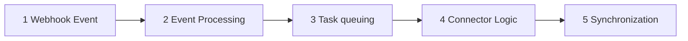

# Architecture

## Composant principaux

### Connectors

Les connecteurs sont des modules qui implémentent la logique de synchronisation vers des applications tierces spécifiques. Chaque connecteur hérite de la classe de base Connector et définit :

- Comment traiter les événements webhook
- Comment mapper les données
- Comment interagir avec l'API tierce

### Configuration webhook

Chaque connecteur peut être configuré pour :

- S'abonner à des événements spécifiques
- Filtrer les données selon des critères
- Définir les paramètres de connexion à l'application tierce

## Connecteurs disponibles

### 1. Connecteur Grist

Objectif: Synchroniser tous les dossiers des portails dans des tables Grist "à plat".

Fonctionnement:

- Écoute les événements de modification de dossiers, tags et réponses de l'état des lieux (EDL)
- Met à jour les tables Grist configurées

Déclencheurs:

- Modification d'un dossier
- Ajout/modification de tags
- Réponses  / modifiées depuis l'EDL

### 2. Connecteur "Les Communs"

Objectif: Partager les dossiers avec le hub "Les communs transition écologique", charger les services et faire remonter l'information dans Recoco via l'API.

Fonctionnement:

- Écoute spécifiquement les événements de type "recommandation"
- Pousse automatiquement le dossier lié vers le hub commun
- Charge les services disponibles
- Crée des "addons de ressources" sur Recoco via l'API

Conditions de déclenchement:

- La recommandation doit porter le tag `les-communs`
- Le dossier doit être autorisé au transfert vers le hub depuis la configuration

## Flux de données

1. Réception webhook: l'application reçoit un événement de modification
2. Traitement et enregistrement de l'événement reçu, vérification des critères de configuration, chargement des connecteurs abonnés à cet événement
3. Mise en queue: création d'une tâche Celery asynchrone pour déclencher les traitements
4. Traitement: exécution de la logique métier du connecteur (on recharge éventuellement l'ensemble des données nécessaires via l'API, on effectue un mapping, puis traitement)
5. Synchronisation: échange des données avec l'application tierce

## Surveillance et logs

### Monitoring

- Logs applicatifs via Django logging
- Monitoring des tâches Celery en base de données (accessibles via django-admin)
- [Sentry](https://sentry.incubateur.net/organizations/betagouv/issues/?environment=prod&project=225&statsPeriod=24h)

### Gestion des erreurs et debugging

- Retry automatique pour les tâches échouées
- Logging détaillé des erreurs de synchronisation
- Alertes en cas d'échec répété

Tous les événements de webhook sont sauvegardés en base à la réception.

Les tâches Celery en echec sont accessibles depuis django-admin.

## Sécurité

- Authentification par clés API
- Validation des payloads webhook
- Chiffrement des données sensibles en base
